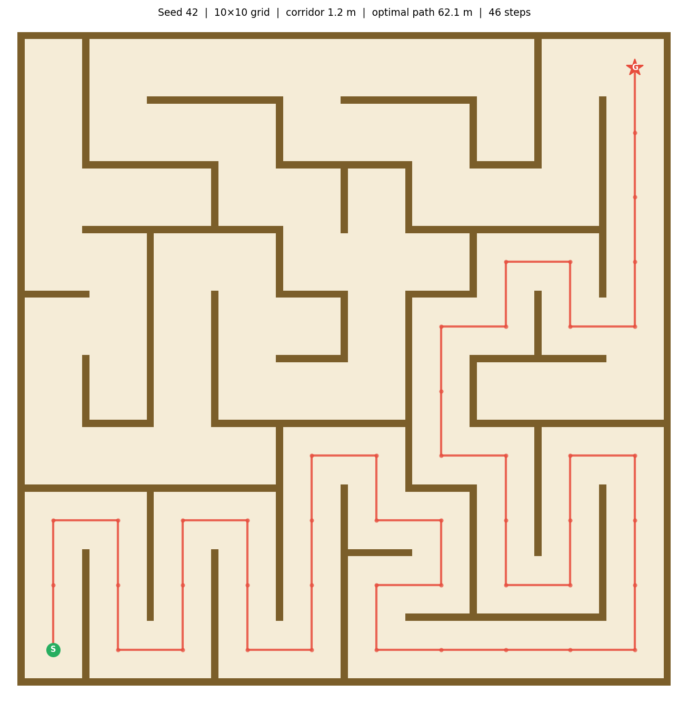
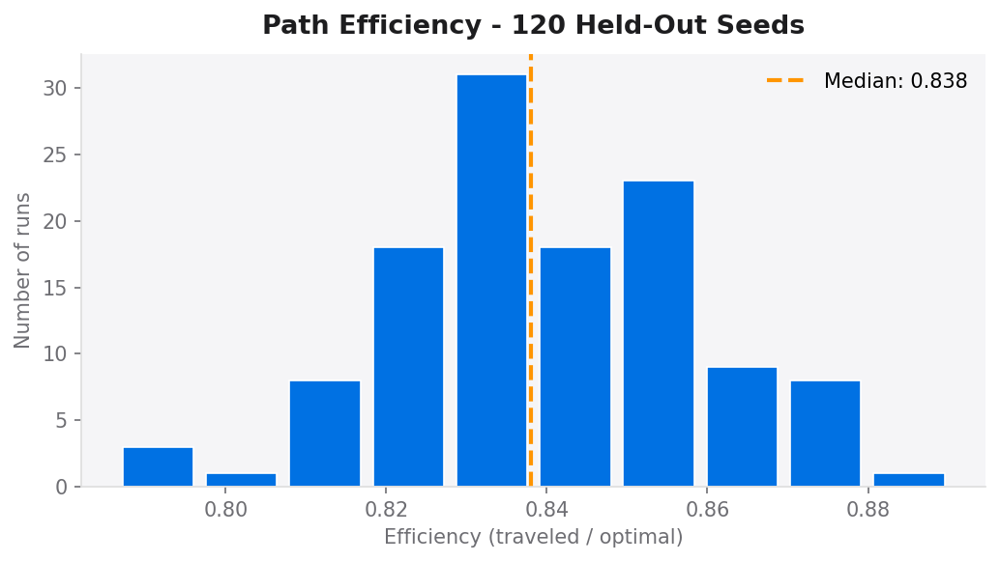
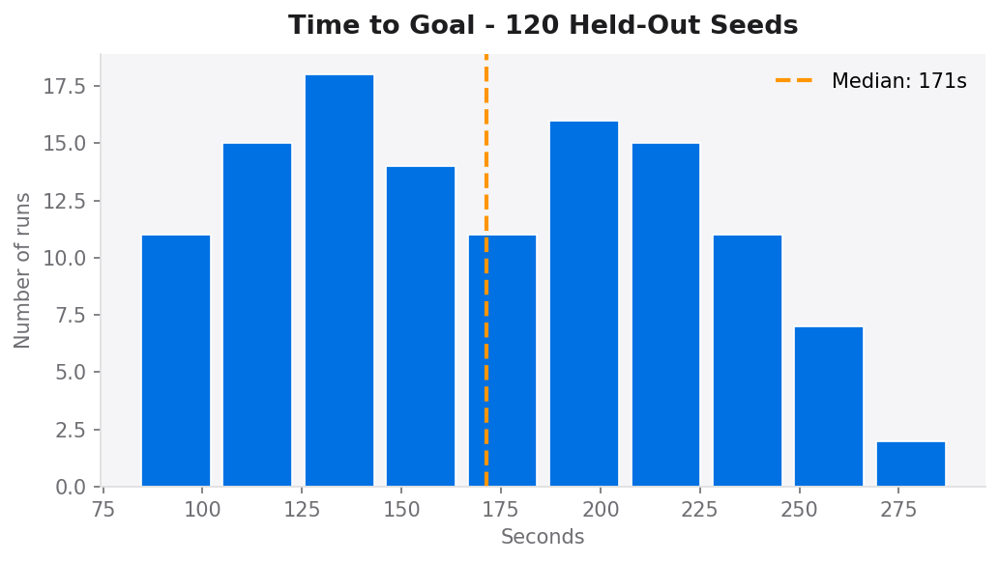

# G1 Maze Navigation — Robotics Ops Assignment

End-to-end autonomous navigation pipeline for the Unitree G1 humanoid robot in MuJoCo.
The robot navigates procedurally generated mazes using only onboard sensors — no ground-truth pose at any point.

**Result: 100% solve rate across 120 held-out seeds. Zero stuck events.**

<p align="center">
  
  &nbsp;&nbsp;&nbsp;
  
</p>
<p align="center">
  <em>Left: Unitree G1 humanoid in MuJoCo &nbsp;|&nbsp; Right: Seed 42 — 10×10 maze with BFS solution path (46 waypoints, 62 m)</em>
</p>

---

## Quick Start

### 1. Setup (one command)

**Windows:**
```
setup.bat
```

**Linux / macOS:**
```
make setup
```

This installs MuJoCo, downloads the G1 model, and creates the `robotics-assignment` conda environment with all pinned dependencies.

### 2. Run the live demo

**Linux / macOS:**
```
make demo SEED=42
```

**Windows:**
```
demo.bat 42
```

A MuJoCo viewer opens. The robot navigates a maze it has never seen, in real time.
You can pass any integer seed — a fresh maze is generated on the fly, no pre-caching.

---

## Entry Points

| Command | Description |
|---|---|
| `make demo SEED=<n>` | Live demo — watch the robot navigate a seeded maze |
| `make run SEED=<n>` | Headless single episode |
| `make record SEED=<n>` | Episode with full data recording (HDF5) |
| `make maze SEED=<n>` | Generate and inspect a maze without running the robot |
| `make batch` | Run all 120 held-out seeds headlessly and save KPIs |
| `make report` | Generate `report/kpi_report.html` from batch results |
| `make test` | Run the full test suite |

All commands use the `robotics-assignment` conda environment automatically.

---

## Reproduce the KPI Report

```
make batch       # runs 120 seeds, writes runs/batch_results.json
make report      # generates report/kpi_report.html
```

Open `report/kpi_report.html` in any browser. No server required.

---

## Project Structure

```
├── runner.py                  # Main episode runner
├── runner_dynamic.py          # Dynamic obstacle demo
├── runner_fault.py            # Sensor fault injection demo
├── Makefile                   # All entry points
├── setup.bat / setup.sh       # One-command environment setup
│
├── maze/                      # Seeded procedural maze generator
├── navigation/                # Full navigation stack
│   ├── occupancy_grid.py      # LiDAR-based occupancy mapping
│   ├── localization.py        # IMU dead-reckoning
│   ├── planner.py             # BFS + Dijkstra + Weighted A*
│   └── controller.py          # Pure-pursuit controller
├── robot/                     # G1 model, sensors, recorder
│   ├── model/g1/              # MuJoCo XML model
│   ├── sensors.py             # LiDAR, IMU, camera interfaces
│   └── recorder.py            # Crash-safe HDF5 data logger
│
├── scripts/
│   ├── batch_eval.py          # Batch KPI evaluator
│   └── compare_planners.py    # Dijkstra vs A* benchmark
│
├── seeds/
│   ├── held_out.txt           # 120 unseen evaluation seeds
│   └── seen.txt               # 10 seen seeds (overfit check)
│
├── runs/                      # Batch results (JSON + HDF5)
├── report/
│   ├── generate_report.py     # KPI report generator
│   └── kpi_report.html        # Latest report
│
└── dashboard/                 # Live telemetry dashboard (browser)
```

---

## Navigation Stack

| Layer | Implementation |
|---|---|
| Perception | 16-ray 270° LiDAR ring on torso |
| Localisation | Seeded gyro-noise IMU dead-reckoning |
| Mapping | Known occupancy grid (0.1 m/cell, 0.3 m inflation) |
| Planning | BFS — corridor-centred waypoints |
| Control | Pure-pursuit (lookahead 0.6 m, max 0.35 m/s) |
| Locomotion | Kinematic freejoint (no joint-torque physics) |

---

## Additional Demos

**Windows:**
```
demo_dynamic.bat 42       # Moving wall obstacle — robot stops and waits
demo_fault.bat 42         # Locked knee joint — sensor fault resilience
demo_compare.bat 42       # Two windows: normal vs dynamic obstacle side by side
```

**Linux / macOS:**
```
make demo-dynamic SEED=42    # Moving wall obstacle — robot stops and waits
make demo-fault SEED=42      # Locked knee joint — sensor fault resilience
```

---

## KPI Summary (120 held-out seeds)

| Metric | Value |
|---|---|
| Solve rate | 100% (95% CI 97%–100%) |
| Median time to goal | 171 s |
| Path efficiency | 0.838 (84% of optimal) |
| Stuck events | 0 |
| Min wall clearance | 0.271 m |

<p align="center">
  
  &nbsp;
  
</p>
<p align="center">
  <em>Left: path efficiency distribution (median 0.838) &nbsp;|&nbsp; Right: time-to-goal distribution (median 171 s) — 120 held-out seeds</em>
</p>

---

## Requirements

- [Anaconda](https://www.anaconda.com/) or Miniconda
- Windows 10/11 or Ubuntu 20.04+
- 8 GB RAM minimum (16 GB recommended for batch runs)
- No GPU required
